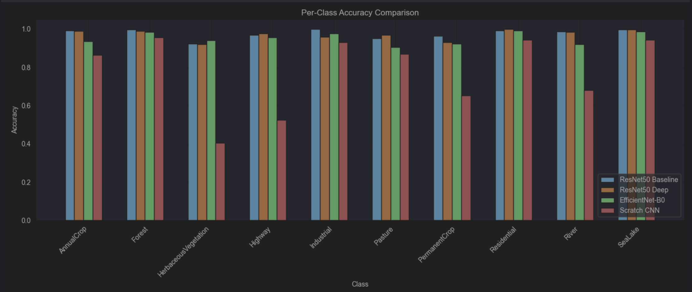
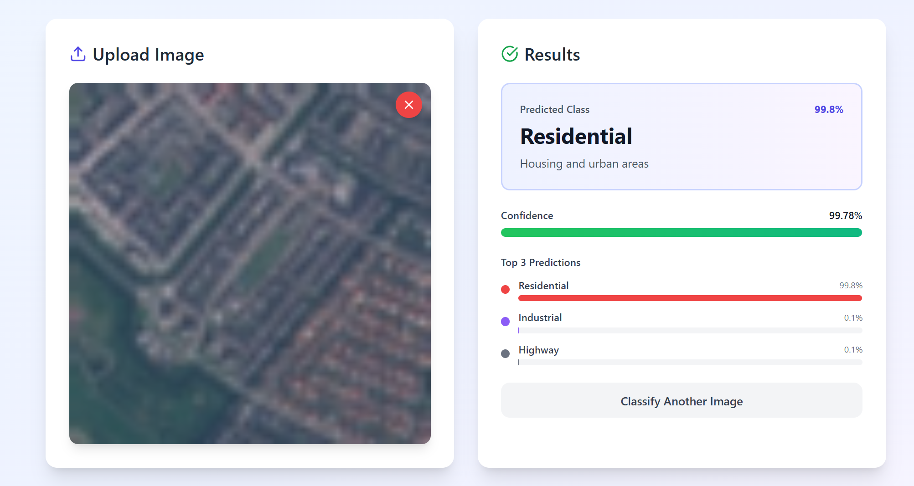

# EuroSAT Satellite Image Classifier

<div align="center">


**A deep learning application for satellite image classification using transfer learning**


</div>

## Overview

EuroSAT Classifier is a full-stack deep learning application that classifies satellite images into 10 land use categories. Built with modern web technologies and transfer learning, this project demonstrates end-to-end ML engineering—from model training to production deployment.

### Key Highlights

- **97%+ accuracy** on EuroSAT validation set
- **Real-time inference** with optimized ResNet50
- **Modern UI/UX** with React 18 and TypeScript
- **Production-ready** architecture with Docker support
- **Comprehensive evaluation** with Grad-CAM visualizations

### Land Use Categories

| Category              | Description | 
|-----------------------|-------------|
| Annual Crop           | Yearly harvested farmland |
| Forest                | Dense tree-covered areas |
| Herbaceous Vegetation | Grasslands and meadows |
| Highway               | Major roads and highways |
| Industrial            | Factories and industrial zones |
| Pasture               | Grazing land for livestock |
| Permanent Crop        | Orchards and vineyards |
| Residential           | Housing and urban areas |
| River                 | Rivers and waterways |
| Sea/Lake              | Large water bodies |

---

## Features

### Model & Training

- **Transfer Learning** with pretrained ResNet50 on ImageNet
- **Multiple Architectures** compared (ResNet50, EfficientNet-B0, Custom CNN)
- **Hyperparameter Tuning** with systematic experimentation
- **Class Imbalance Handling** using weighted loss
- **Data Augmentation** (rotation, flipping, color jitter)
- **Model Explainability** with Grad-CAM visualizations
- **Comprehensive Logging** with TensorBoard

### Web Application

- **Modern React UI** with TypeScript and Tailwind CSS
- **Drag & Drop Upload** with instant preview
- **Real-time Predictions** with confidence scores
- **Top-3 Predictions** with probability visualization
- **Responsive Design** optimized for all devices
- **Accessibility** compliant (ARIA labels, keyboard navigation)
- **Input Validation** and error handling

### Backend API

- **Fast Inference** with optimized model loading
- **Input Validation** (file type, size, format)
- **Structured Logging** for debugging and monitoring
- **RESTful API** with clean endpoint design
- **Docker Support** for easy deployment
- **Health Check** endpoint for monitoring

---

## Architecture

```
┌─────────────────┐
│   React Frontend│
│   (TypeScript)  │
└────────┬────────┘
         │ HTTP
         │
┌────────▼────────┐
│   Flask API     │
│   (Python)      │
└────────┬────────┘
         │
┌────────▼────────┐
│  PyTorch Model  │
│   (ResNet50)    │
└─────────────────┘
```

### Data Flow

1. **User uploads** satellite image (PNG, JPG, TIFF)
2. **Frontend validates** file size and type
3. **Backend preprocesses** image (resize, normalize)
4. **Model predicts** land use class with confidence
5. **Results returned** with top-3 predictions
6. **UI displays** results with visual feedback

---

## Tech Stack

### Machine Learning
- **PyTorch 2.1** - Deep learning framework
- **TorchVision** - Pretrained models and transforms
- **NumPy** - Numerical computing
- **Pillow** - Image processing
- **Matplotlib** - Visualization

### Backend
- **Flask 3.0** - Web framework
- **Flask-CORS** - Cross-origin resource sharing
- **Gunicorn** - WSGI HTTP server

### Frontend
- **React 18** - UI library
- **TypeScript** - Type-safe JavaScript
- **Vite** - Build tool and dev server
- **Tailwind CSS** - Utility-first CSS
- **Lucide React** - Icon library

---

## Getting Started

### Prerequisites

- Python 3.10+
- Node.js 18+
- npm or yarn
- (Optional) Docker & Docker Compose

### Installation

#### 1. Clone the Repository

```bash
git clone https://github.com/yourusername/eurosat-classifier.git
cd dl-project
```

#### 2. Backend Setup

```bash
cd api

# Create virtual environment
python -m venv venv
source venv/bin/activate  # Windows: venv\Scripts\activate

# Install dependencies
pip install -r requirements.txt

# Place your trained model
# saved_models/.../... should exist
```

#### 3. Frontend Setup

```bash
cd frontend

# Install dependencies
npm install

# Create environment file
echo "VITE_API_URL=http://localhost:5000" > .env
```

#### 4. Run the Application

**Terminal 1 - Backend:**
```bash
cd api
python app.py
# Runs on http://localhost:5000
```

**Terminal 2 - Frontend:**
```bash
cd frontend
npm run dev
# Runs on http://localhost:5173
```

### Training Details

- **Dataset**: EuroSAT RGB (27,000 images)
- **Split**: 70% train / 20% validation / 10% test
- **Augmentation**: Rotation, flip, color jitter
- **Optimizer**: Adam (lr=0.00001) - for the best model
- **Loss**: Weighted Cross-Entropy
- **Epochs**: 10
- **Batch Size**: 32

### Per-Class Performance (ResNet50)

---

## API Documentation

### Base URL
```
http://localhost:5000/api
```

### Endpoints

#### Health Check
```http
GET /api/health
```

**Response:**
```json
{
  "status": "healthy",
  "model_loaded": true,
  "device": "cpu"
}
```

#### Get Classes
```http
GET /api/classes
```

**Response:**
```json
{
  "classes": [
    {"id": 0, "name": "Annual Crop"},
    {"id": 1, "name": "Forest"},
    ...
  ]
}
```

#### Classify Image
```http
POST /api/predict
Content-Type: multipart/form-data
```

**Request:**
- `image`: File (PNG, JPG, TIFF, max 10MB)

**Response:**
```json
{
  "success": true,
  "prediction": {
    "class_id": 1,
    "class_name": "Forest",
    "confidence": 0.9823,
    "all_probabilities": [0.002, 0.982, 0.001, ...],
    "top_k": [
      {"class_id": 1, "class_name": "Forest", "probability": 0.982},
      {"class_id": 0, "class_name": "Annual Crop", "probability": 0.012},
      ...
    ]
  },
  "image_info": {
    "filename": "satellite_image.jpg",
    "size": 245678,
    "dimensions": "224x224"
  }
}
```

---

## Development

### Running Tests

```bash
# Backend
cd api
pytest tests/

# Frontend
cd frontend
npm test
```

### Code Quality

```bash
# Python linting
flake8 api/
black api/ --check

# TypeScript linting
cd frontend
npm run lint
```

### Training New Models

```bash
cd notebooks
jupyter notebook 02-model-training.ipynb
```

---

## Deployment

### AWS Deployment

1. **S3 + CloudFront** for frontend
2. **EC2 or ECS** for backend
3. **Load Balancer** for traffic distribution

### Heroku Deployment

```bash
# Backend
heroku create eurosat-api
git push heroku main

# Frontend (Netlify or Vercel)
npm run build
netlify deploy --prod
```

### Environment Variables

**Backend (.env):**
```env
MODEL_PATH=saved_models/resnet_final_tuned/best_model.pt
DEVICE=cpu
DEBUG=False
```

**Frontend (.env):**
```env
VITE_API_URL=https://your-api-domain.com
```


<div align="center">

Made with ❤️ and ☕

</div>